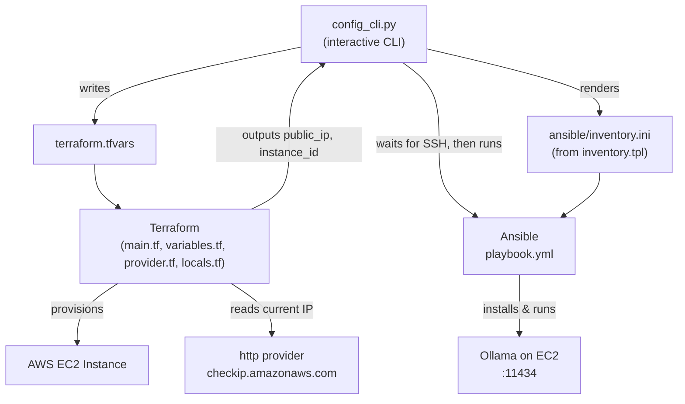

# EC2 x Ollama — Automated LLM Deployment

A CLI tool that spins up an AWS EC2 instance and auto-installs [Ollama](https://ollama.com) on it using Terraform + Ansible, all driven from a single interactive Python script.

## What it does

1. `config.py` asks you for config (region, instance type, AMI, key pair, subnet, model) via an interactive menu.
2. Writes those answers to `terraform.tfvars`.
3. Runs `terraform init` + `terraform apply` to provision the EC2 instance (security group locked to your current public IP via the `http` provider).
4. Generates an Ansible `inventory.ini` from the Terraform output (public IP).
5. Waits for SSH to come up, then runs `playbook.yml`, which installs Ollama and pulls/runs the chosen model.
6. Prints the Ollama endpoint (`http://<public_ip>:11434`).
7. Offers a menu to `terraform destroy` the infra when you're done.

## Architecture



## Project structure

```
awsllama/
├── config.py               # Interactive CLI: collects config, drives Terraform + Ansible
├── README.md
├── .gitignore
├── myenv/                   # Python virtual environment (gitignored)
├── __pycache__/             # (gitignored)
├── ansible/
│   ├── playbook.yml         # Installs Ollama, runs the chosen model
│   └── inventory.ini        # Generated per-deployment (gitignored)
└── terraform/
    ├── main.tf              # EC2 instance module + security group
    ├── variables.tf         # Input variables (region, AMI, subnet, key, model...)
    ├── provider.tf          # AWS provider
    ├── locals.tf            # Fetches your public IP for SSH whitelisting
    ├── output.tf            # Outputs (public IP, instance ID)
    └── terraform.tfvars      # Generated per-run config (gitignored)
```

## Networking (VPC / Subnet)

This project **does not create a VPC or subnet** — it deploys into an existing one. When you run the CLI, it asks for a `subnet_id`, and the instance is launched into whatever VPC that subnet belongs to. The security group created in `main.tf` is scoped to that VPC automatically (via the module), with SSH ingress locked to your current public IP.

If you don't already have a VPC/subnet you want to use, create one first (or use your account's default VPC) and pass its subnet ID when prompted.

## Prerequisites

- AWS account + credentials configured (`aws configure` or env vars)
- Terraform installed
- Ansible installed
- An existing EC2 key pair (`.pem` file) on your machine
- Python 3 with `pyfiglet` (`pip install pyfiglet`)

## Usage

```bash
python config.py
```

Follow the prompts, then wait — the script handles provisioning, inventory generation, SSH readiness, and the Ansible run automatically. When you're done, choose "Destroy infrastructure" from the final menu to tear everything down.

## Known limitations

- `config.py` hardcodes `ansible_user=ubuntu` in `create_inventory()` — fine for Ubuntu AMIs, but the `get_ssh_user()` helper that detects the right user per-AMI isn't actually wired in yet.
- **State is local only** (`terraform.tfstate` on disk, gitignored). There's no remote backend, so state isn't shared, versioned, or locked — fine for a solo demo, not for a team/production setup.
- VPC/subnet must already exist; the CLI only consumes a subnet ID, it doesn't provision networking.
- SSH host-key checking is disabled for the Ansible connection (StrictHostKeyChecking=no), since each deployment gets a fresh EC2 instance with a new public IP that's never been seen before. This is fine for short-lived dev/demo instances; if you adapt this for long-lived production hosts, remove that setting and manage known_hosts properly.

## Future scope

- **Remote state backend** — move state to an S3 bucket with DynamoDB for locking, so state is durable, shareable, and locked against concurrent applies.
- **Automatic VPC/subnet provisioning** — optionally create a VPC + subnet if the user doesn't already have one, instead of requiring an existing subnet ID.
- **Local pre-flight checks** — an install/setup step that verifies `aws --version`, valid AWS credentials (`aws sts get-caller-identity`), Terraform, and Ansible are present before doing anything, with clear errors if not.
- **Persisted user config** — remember the chosen VPC/subnet/region across runs (e.g. a local config file) so repeat deployments don't need re-entering the same values.
- **CI validation** — `terraform validate` / `terraform fmt -check` on push via GitHub Actions.
